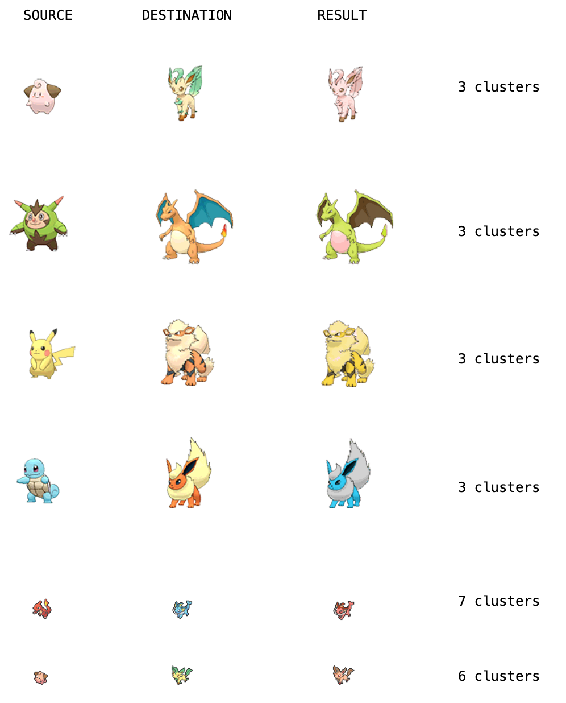

# Color Shift

<i>Color shift</i> grabs n dominant colors from an image using KMeans, and transfers these colors over to a given destination image.

## How to use

```
python3 color-shift.py
```

Color shift is composed of only one python file, making it easy to use.
- The only things that must be changed in the code are the number of clusters desired and the destination/source images.

## Results

I tested the code on many images of different Pokemon, which is showcased below. Different cluster sizes worked better for different images. The program also works best on images that are more simplistic, which I hope to improve in the future. 
Here are some of my favorite transformations:


